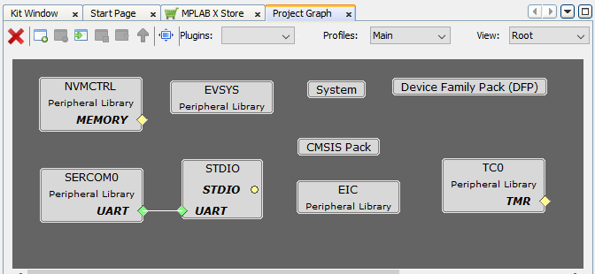
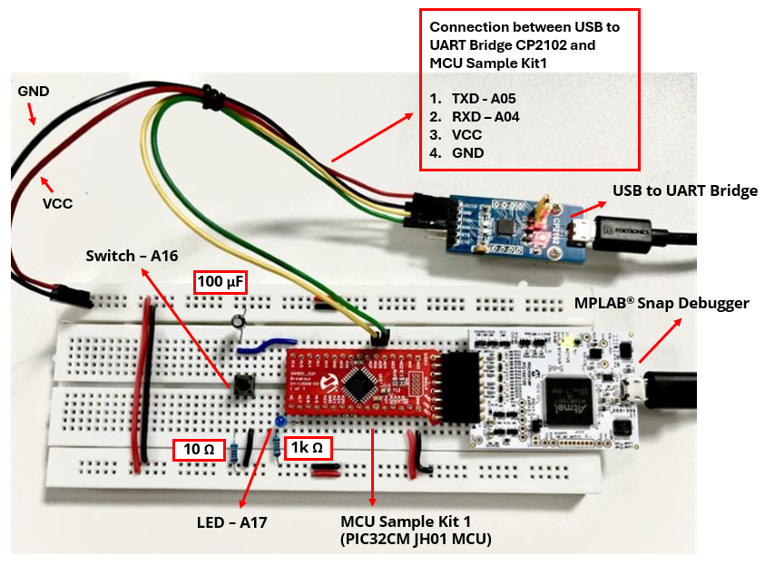
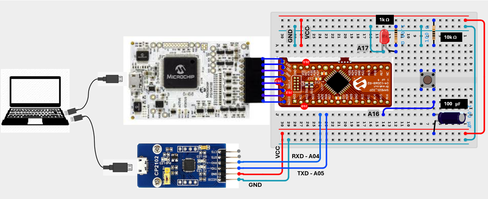
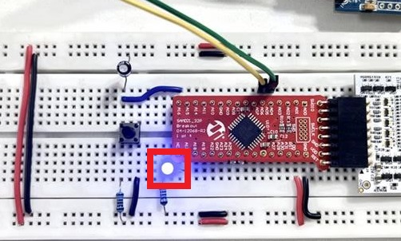
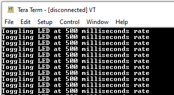

# Getting Started with the PIC32CM JH01 MCU using the MCU Sample Kit 1
<h2 align="center"> <a href="https://github.com/Microchip-MPLAB-Harmony/reference_apps_pic32ck/releases/latest/download/pic32ck_sg01_cult_getting_started_drv.zip" > Download </a> </h2>

-----
## Description:
	
> This application demonstrates the basic feature of LED Toggling and Switch Press on the PIC32CM JH01 MCU using the MCU sample kit 1 on breadboard.

- The LED toggles on a timeout basis and prints the LED toggling rate on the serial terminal. The periodicity of the timeout will change from 500 milliseconds to 1 second, 2 seconds, 4 seconds, and back to 500 milliseconds every time the user presses the Switch on breadboard.
	
## Modules/Technology Used:
- Peripheral Modules
	- DMAC
	- EIC
	- PORT
	- SERCOM0
	- TC0

	The MCC Harmony project graph with all the components would look like this:

	

## Hardware Used:

- [MCU Sample Kit 1 (PIC32CM JH01 MCU)](https://static.gamma.pl/pdf/microchip/MCU-Sample-Kit-Users-Guide-DS70005579.pdf)
- [MPLAB SNAP](https://www.microchip.com/en-us/development-tool/pg164100) 
- [USB to UART Bridge](https://www.silabs.com/interface/usb-bridges/classic/device.cp2102?tab=specs)
- Capacitor - 100 μF (filtering)
- Resistor - 1k Ω (led current limitting)
- Resistor - 10k Ω (pullup)
- LED
- Switch
- Breadboard

## Software/Tools Used:
 This project has been verified to work with the following versions of software tools:  

- [MPLAB X IDE](https://www.microchip.com/en-us/tools-resources/develop/mplab-x-ide) v6.25
- [MPLAB Code Configurator Plugin](https://www.microchip.com/en-us/tools-resources/configure/mplab-code-configurator)  v5.5.2
- [MPLAB XC32 Compiler](https://www.microchip.com/en-us/tools-resources/develop/mplab-xc-compilers) v4.60
- [csp](https://github.com/Microchip-MPLAB-Harmony/csp) v3.22.2
- CMSIS_5 v5.9.0
- PIC32CM-JH_DFP v1.2.208
- [USB to UART Bridge Driver CP2102](https://www.silabs.com/interface/usb-bridges/classic/device.cp2102?tab=specs) or any USB to UART Bridge Driver

Refer [Project Manifest](./firmware/src/config/mcu_sample_kit1_jh/harmony-manifest-success.yml) present in harmony-manifest-success.yml under the project folder *firmware/src/config/mcu_sample_kit1_jh*  

- Refer the [Release Notes](../../../../../release_notes.md#development-tools) to know the **MPLAB X IDE** and **MCC** Plugin version. 
- Any Serial Terminal application like Tera Term/PuTTY terminal application.

 Because Microchip regularly update tools, occasionally issue(s) could be discovered while using the newer versions of the tools. If the project doesn’t seem to work and version incompatibility is suspected, It is recommended to double-check and use the same versions that the project was tested with.  To download original version of MPLAB Harmony v3 packages, refer to document [How to Use the MPLAB Harmony v3 Project Manifest Feature](https://ww1.microchip.com/downloads/en/DeviceDoc/How-to-Use-the-MPLAB-Harmony-v3-Project-Manifest-Feature-DS90003305.pdf)

## Hardware Setup: 
- Place the MCU Sample Kit 1 (PIC32CM JH01 MCU) on the breadboard.
- MPLAB® Snap allows the In-Circuit Debugger/Programmer to be used for debugging and programming the application.
   
   **Note** : *The MCU Sample Kit 1 (PIC32CM JH01 MCU) does not have a built-in debugger, so the MPLAB® Snap is used for programming the application.*
- Connect the MPLAB® Snap to the programming header (J13) on the MCU Sample Kit 1 (PIC32CM JH01 MCU).
- Connect the MPLAB® Snap to the host PC using a Type-A male to micro-B USB cable.   
- Connect the user LED to pin A17 and the switch to pin A16 on the breadboard.
- Establish the connection between the [USB to UART Bridge](https://www.silabs.com/interface/usb-bridges/classic/device.cp2102?tab=specs) and the [MCU Sample Kit 1 (PIC32CM JH01 MCU)](https://static.gamma.pl/pdf/microchip/MCU-Sample-Kit-Users-Guide-DS70005579.pdf) on the breadboard using the following connections:
	- TXT to A04
	- RXT to A05
	- VCC to VDD
	- GND to GND
- Connect the USB to UART bridge driver to the host PC using a Type-A male to micro-B USB cable.
	 

### Connection Diagram:

 

## Programming hex file:
The pre-built hex file can be programmed by following the below steps.  

### Steps to program the hex file
- Open MPLAB X IDE
- Close all existing projects in IDE, if any project is opened.
- Go to File -> Import -> Hex/ELF File
- In the "Import Image File" window, Step 1 - Create Prebuilt Project, Click the "Browse" button to select the prebuilt hex file.
- Select Device has "PIC32CM5164JH01032"
- Ensure the proper tool is selected under "Hardware Tool"
- Click on Next button
- In the "Import Image File" window, Step 2 - Select Project Name and Folder, select appropriate project name and folder
- Click on Finish button
- In MPLAB X IDE, click on "Make and Program Device" Button. The device gets programmed in sometime
- Follow the steps in "Running the Demo" section below

## Programming/Debugging Application Project:
- Open the project (mcu_sample_kit1_jh_get_start/firmware/mcu_sample_kit1_jh.X) in MPLAB X IDE
- Then right click on the project (get_start_mcu_sample_kit1_jh) and click **Set as Main Project**.
- Ensure "MPLAB SNAP" is selected as hardware tool to program/debug the application
- Build the code and program the device by clicking on the "make and program" button in MPLAB X IDE tool bar
- Follow the steps in "Running the Demo" section below

## Running the Demo:
- Open the Tera Term/PuTTY terminal application on your PC (from the Windows® Start menu by pressing the Start button)
- Set the baud rate to 115200
- An LED on the BreadBoard connection toggles continuously on every timeout basis as shown in the below figure.

	 
- The default periodicity of the timeout is 500 milliseconds.

	 
- Press the switch on the BreadBoard connection to change the default periodicity of the timeout to one second and also, the LED toggling rate is displayed on the serial terminal.
	
	 
- Every subsequent pressing of the switch on the BreadBoard connection changes the periodicity of the timeout to 2seconds, 4 seconds, 500 milliseconds, and back to 1 second in cyclic order

## Comments: 
- Reference Training Module - [ Getting Started with Harmony v3 Peripheral Libraries on SAMC2x MCUs.](https://developerhelp.microchip.com/xwiki/bin/view/software-tools/harmony/samc21-getting-started-training-module/)
- This application demo builds and works out of box by following the instructions above in "Running the Demo" section. If you need to enhance/customize this application demo, you need to use the MPLAB Harmony v3 Software framework. Refer links below to setup and build your applications using MPLAB Harmony.
	- [How to Setup MPLAB Harmony v3 Software Development Framework](https://ww1.microchip.com/downloads/aemDocuments/documents/MCU32/ProductDocuments/SupportingCollateral/How-to-Setup-MPLAB-Harmony-v3-Software-Development-Framework-DS90003232.pdf)
	- [How to Build an Application by Adding a New PLIB, Driver, or Middleware to an Existing MPLAB Harmony v3 Project](https://ww1.microchip.com/downloads/aemDocuments/documents/MCU32/ProductDocuments/SupportingCollateral/How-to-Build-an-Application-by-Adding-a-New-PLIB-Driver-or-Middleware-to-an-Existing-MPLAB-Harmony-v3-Project-DS90003253.pdf)	
	- [Video - How to Set up the Tools Required to Get Started with MPLAB® Harmony v3 and MCC](https://www.youtube.com/watch?v=0rNFSlsVwVw)	
	- [Create a new MPLAB Harmony v3 project using MCC](https://developerhelp.microchip.com/xwiki/bin/view/software-tools/harmony/getting-started-training-module-using-mcc/)
	- [Update and Configure an Existing MHC-based MPLAB Harmony v3 Project to MCC-based Project](https://developerhelp.microchip.com/xwiki/bin/view/software-tools/harmony/update-and-configure-existing-mhc-proj-to-mcc-proj/)

## Revision:
- v1.7.0 - Released demo application
