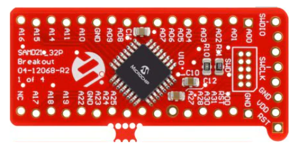

# MCU Sample Kit 1 JH
<h4 align="left">  </h4>

This repository contains the MPLAB® Harmony 3 reference applications developed on [MCU Sample Kit 1](https://www.microchip.com/en-us/development-tool/BB37Z60A)   

|SI No| Demo Name | Download Link |
| --- | --- | -- |
| 1 | [mcu_sample_kit1_jh_get_start](./mcu_sample_kit1_jh_get_start/readme.md) | [Click Here](https://github.com/Microchip-MPLAB-Harmony/reference_apps_pic32cm/releases/latest/download/mcu_sample_kit1_jh_get_start.zip) |

### More Application Demos

For more application demos on **MCU Sample Kit 1 JH** and other Development Boards/Kits having the same part number **(PIC32CM5164JH01032)** <a href="https://mplab-discover.microchip.com/v1/itemtype/com.microchip.ide.project?s0=PIC32CM5164JH01032" target="_blank"> CLICK HERE </a>
