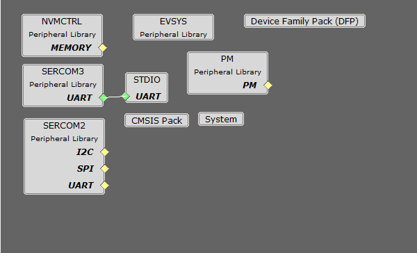
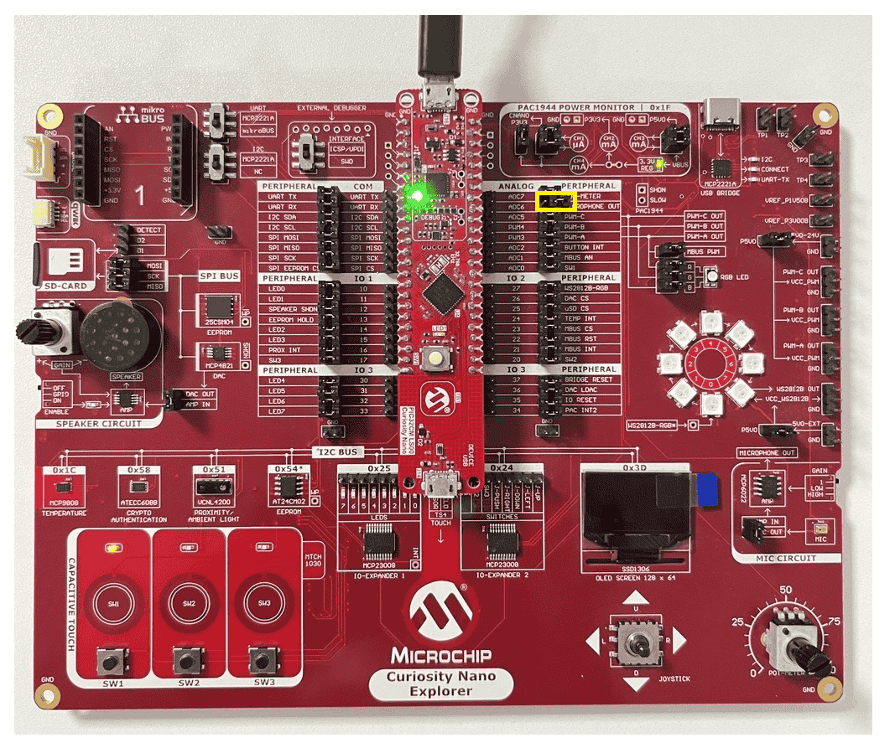
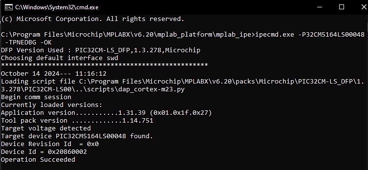
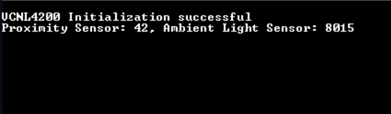
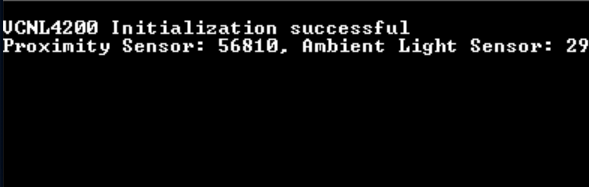

# Proximity light sensor example Application on PIC32CM LS00 Curiosity Nano + Touch Evaluation Kit
<h2 align="center"> <a href="https://github.com/Microchip-MPLAB-Harmony/reference_apps/releases/latest/download/pic32cm_ls00_cnano_proximity.zip" > Download </a> </h2>

-----
## Description:

> This application demonstrates how to interface VCNL4200 with Curiosity Nano Explorer board and PIC32CM LS00 Curiosity Nano + Touch Evaluation kit. VCNL4200 integrates a high sensitivity proximity sensor, ambient light sensor and 940 nm IRED into one small package and it is present in Curiosity Nano Explorer Board. Proximity sensor detects nearby objects whereas ambient light sensor detects light intensity. Based on the light source and object's distance from the sensor, the value generated by ambient light sensor and proximity sensor varies.

## Modules/Technology Used:
- Peripheral Modules
	- PM
	- SYSTICK
	- SERCOM2
	- SERCOM3
	- EVSYS
	- STDIO

The MCC Harmony project graph would look like this:
	
  	

## Hardware Used:

- [PIC32CM LS00 Curiosity Nano + Touch Evaluation Kit](https://www.microchip.com/DevelopmentTools/ProductDetails/PartNO/EV41C56A)
- [Curiosity Nano Explorer](https://www.microchip.com/en-us/development-tool/EV58G97A)

## Software/Tools Used:
 This project has been verified to work with the following versions of software tools:  
- [MPLAB X IDE](https://www.microchip.com/en-us/tools-resources/develop/mplab-x-ide) v6.20
- [MPLAB Code Configurator Plugin](https://www.microchip.com/en-us/tools-resources/configure/mplab-code-configurator)  v5.5.1
- [MPLAB XC32 Compiler](https://www.microchip.com/en-us/tools-resources/develop/mplab-xc-compilers) v4.45
- [csp](https://github.com/Microchip-MPLAB-Harmony/csp) v3.20.0
- CMSIS_5 v5.9.0
- PIC32CM-LS_DFP v1.3.278

Refer [Project Manifest](./firmware/src/config/pic32cm_ls00_cnano/harmony-manifest-success.yml) present in harmony-manifest-success.yml under the project folder *pic32cm_ls00_cnano_proximity/firmware/src/config/pic32cm_ls00_cnano*  
- Refer the [Release Notes](../../../../../release_notes.md#development-tools) to know the **MPLAB X IDE** and **MCC** Plugin version. Alternatively, [Click Here](https://github.com/Microchip-MPLAB-Harmony/reference_apps/blob/master/release_notes.md#development-tools).

 Because Microchip regularly update tools, occasionally issue(s) could be discovered while using the newer versions of the tools. If the project doesn’t seem to work and version incompatibility is suspected, It is recommended to double-check and use the same versions that the project was tested with.  To download original version of MPLAB Harmony v3 packages, refer to document [How to Use the MPLAB Harmony v3 Project Manifest Feature](https://ww1.microchip.com/downloads/en/DeviceDoc/How-to-Use-the-MPLAB-Harmony-v3-Project-Manifest-Feature-DS90003305.pdf)

## Setup:
- Connect the PIC32CM LS00 Curiosity Nano + Touch Evaluation Kit to the host PC using a Type-A male to micro-B USB cable. Plug the cable into the Micro-B USB (Debug USB) port on the evaluation kit.  

  
  
**Note**: Remove the shorted jumper on the *Microphone OUT* for I2C communication as shown in the above figure.

## Programming hex file:
The pre-built hex file can be programmed by following the below steps.  

### Steps to program the hex file
- Open MPLAB X IDE
- Close all existing projects in IDE, if any project is opened.
- Go to File -> Import -> Hex/ELF File
- In the "Import Image File" window, Step 1 - Create Prebuilt Project, Click the "Browse" button to select the prebuilt hex file
- Select Device has "PIC32CM5164LS00048"
- Ensure the proper tool is selected under "Hardware Tool"
- Click on Next button
- In the "Import Image File" window, Step 2 - Select Project Name and Folder, select appropriate project name and folder
- Click on Finish button
- In MPLAB X IDE, click on "Make and Program Device" Button. The device gets programmed in sometime
- Follow the steps in "Running the Demo" section below

## Programming/Debugging Application Project:
- Open the project (pic32cm_ls00_cnano_proximity/firmware/proximity_pic32cm_ls00_cnanogroup) in MPLAB X IDE.
- Right click on "proximity_pic32cm_ls00_cnanogroup" file and go to *Open Required projects > Open All Projects*.
- Then right click on the non-secure project and click *Set as Main Project*.
- Ensure "PIC32CM LS00 Curiosity Nano" is selected as hardware tool to program/debug the application
- Build the code and program the device by clicking on the "make and program" button in MPLAB X IDE tool bar
- Follow the steps in "Running the Demo" section below.

## Running the Demo:
- Open the Tera Term/PuTTY terminal application on your PC (from the Windows® Start menu by pressing the Start button)
- Set the baud rate to 115200
- To Reset the device, run this command: **ipecmd.exe -P32CM5164LS00048 -TPNEDBG -OK** from the following location: *C:/Program Files/Microchip/MPLABX/v6.20/mplab_platform/mplab_ipe*
	

**NOTE**: *The PIC32CM LS00 Curiosity Nano + Touch Evaluation Kit does not include a reset button. Therefore, the device can be reset by executing the reset command in the CMD prompt.*

- The console prints the value of proximity sensor and ambient light sensor as shown in the figure below

	

- The value of proximity sensor increases as an object moves closer to the sensor and decreases as the object moves further away from the sensor. 
- The value of ambient light sensor increases when light source is close to the sensor and decreases as the light source moves further away from the sensor.

	
	
## Comments:
- Reference Training Module: [Arm TrustZone Getting Started Application on PIC32CM LS60 (Arm Cortex-M23) MCUs](https://developerhelp.microchip.com/xwiki/bin/view/software-tools/harmony/pic32cm-trustzone-getting-started-training-module/)
- This application demo builds and works out of box by following the instructions above in "Running the Demo" section. If you need to enhance/customize this application demo, you need to use the MPLAB Harmony v3 Software framework. Refer links below to setup and build your applications using MPLAB Harmony.
	- [How to Setup MPLAB Harmony v3 Software Development Framework](https://ww1.microchip.com/downloads/aemDocuments/documents/MCU32/ProductDocuments/SupportingCollateral/How-to-Setup-MPLAB-Harmony-v3-Software-Development-Framework-DS90003232.pdf)	
	- [Video - How to Set up the Tools Required to Get Started with MPLAB® Harmony v3 and MCC](https://www.youtube.com/watch?v=0rNFSlsVwVw)	
	- [Create a new MPLAB Harmony v3 project using MCC](https://developerhelp.microchip.com/xwiki/bin/view/software-tools/harmony/getting-started-training-module-using-mcc/)
	- [Update and Configure an Existing MHC-based MPLAB Harmony v3 Project to MCC-based Project](https://developerhelp.microchip.com/xwiki/bin/view/software-tools/harmony/update-and-configure-existing-mhc-proj-to-mcc-proj/)
	- [How to Build an Application by Adding a New PLIB, Driver, or Middleware to an Existing MPLAB Harmony v3 Project](https://ww1.microchip.com/downloads/aemDocuments/documents/MCU32/ProductDocuments/SupportingCollateral/How-to-Build-an-Application-by-Adding-a-New-PLIB-Driver-or-Middleware-to-an-Existing-MPLAB-Harmony-v3-Project-DS90003253.pdf)	

## Revision:
- v1.7.0 - Released demo application