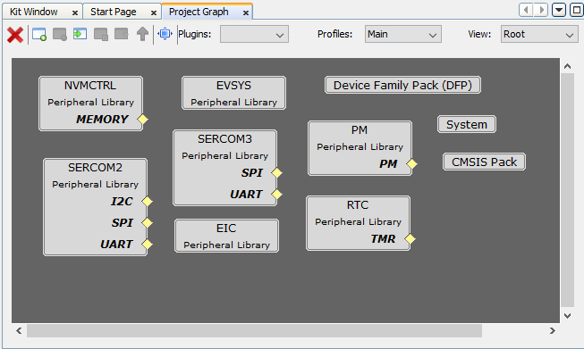
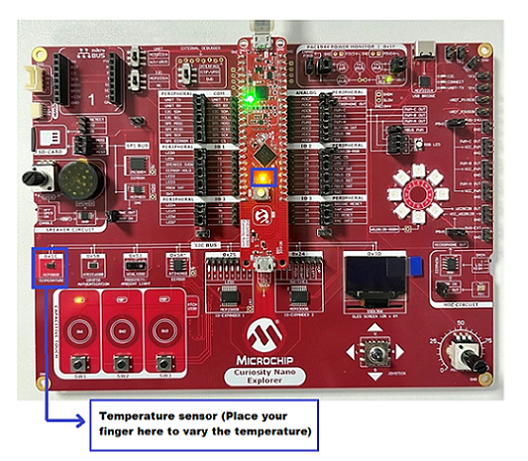
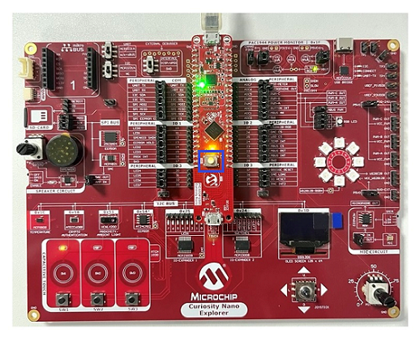
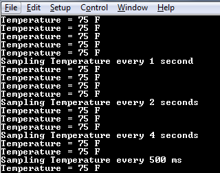

# Temperature example Application on PIC32CM LS00 Curiosity Nano+ Touch Evaluation Kit
<h2 align="center"> <a href="https://github.com/Microchip-MPLAB-Harmony/reference_apps/releases/latest/download/pic32cm_ls00_cnano_temp.zip" > Download </a> </h2>

-----
## Description:

> The application reads the current room temperature from the temperature sensor on the Curiosity Nano Explorer. The temperature read is displayed on a serial console periodically every 500 milliseconds. The periodicity of the temperature values displayed on the serial console is changed to 1 second, 2 seconds, 4 seconds and back to 500 milliseconds every time the switch SW1 is pressed on the PIC32CM LS00 Curiosity Nano+ Touch Evaluation Kit. Also, an LED1 is toggled every time the temperature is displayed on the serial console.

## Modules/Technology Used:
- Peripheral Modules
	- SERCOM2 (I2C)
	- SERCOM3 (USART)
	- RTC
	- EIC
	- DMA (DMAC)
	- PM
	- EVSYS
	- NVMCTRL
	- PORT

The MCC Harmony project graph would look like this:
	
  	

## Hardware Used:

- [PIC32CM LS00 Curiosity Nano+ Touch Evaluation Kit](https://www.microchip.com/DevelopmentTools/ProductDetails/PartNO/EV41C56A)
- [Curiosity Nano Explorer](https://www.microchip.com/en-us/development-tool/EV58G97A)

## Software/Tools Used:
 This project has been verified to work with the following versions of software tools:  
- [MPLAB X IDE](https://www.microchip.com/en-us/tools-resources/develop/mplab-x-ide) v6.20
- [MPLAB Code Configurator Plugin](https://www.microchip.com/en-us/tools-resources/configure/mplab-code-configurator)  v5.5.1
- [MPLAB XC32 Compiler](https://www.microchip.com/en-us/tools-resources/develop/mplab-xc-compilers) v4.45
- [csp](https://github.com/Microchip-MPLAB-Harmony/csp) v3.19.5
- CMSIS_5 v5.9.0
- PIC32CM-LS_DFP v1.2.274

Refer [Project Manifest](./firmware/src/config/pic32cm_ls00_cnano/harmony-manifest-success.yml) present in harmony-manifest-success.yml under the project folder *pic32cm_ls00_cnano_temp/firmware/src/config/pic32cm_ls00_cnano*  
- Refer the [Release Notes](../../../../../release_notes.md#development-tools) to know the **MPLAB X IDE** and **MCC** Plugin version. Alternatively, [Click Here](https://github.com/Microchip-MPLAB-Harmony/reference_apps/blob/master/release_notes.md#development-tools).

 Because Microchip regularly update tools, occasionally issue(s) could be discovered while using the newer versions of the tools. If the project doesn’t seem to work and version incompatibility is suspected, It is recommended to double-check and use the same versions that the project was tested with.  To download original version of MPLAB Harmony v3 packages, refer to document [How to Use the MPLAB Harmony v3 Project Manifest Feature](https://ww1.microchip.com/downloads/en/DeviceDoc/How-to-Use-the-MPLAB-Harmony-v3-Project-Manifest-Feature-DS90003305.pdf)

## Setup:
- Connect the Type-A male to Micro-B USB cable to Micro-B DEBUG USB port to program and debug the PIC32CM LS00 Curiosity Nano+ Touch Evaluation Kit.  

  
 
 **Note:** Remove the shorted jumper on the *Microphone OUT* for I2C communication as shown in the above figure.

## Programming hex file:
The pre-built hex file can be programmed by following the below steps.  

### Steps to program the hex file
- Open MPLAB X IDE
- Close all existing projects in IDE, if any project is opened.
- Go to File -> Import -> Hex/ELF File
- In the "Import Image File" window, Step 1 - Create Prebuilt Project, Click the "Browse" button to select the prebuilt hex file
- Select Device has "PIC32CM5164LS00048"
- Ensure the proper tool is selected under "Hardware Tool"
- Click on Next button
- In the "Import Image File" window, Step 2 - Select Project Name and Folder, select appropriate project name and folder
- Click on Finish button
- In MPLAB X IDE, click on "Make and Program Device" Button. The device gets programmed in sometime
- Follow the steps in "Running the Demo" section below

## Programming/Debugging Application Project:
- Open the project (pic32cm_ls00_cnano_temp/firmware/temp_pic32cm_ls00_cnanogroup) in MPLAB X IDE
- Ensure "PIC32CM LS00 Curiosity Nano" is selected as hardware tool to program/debug the application
- Build the code and program the device by clicking on the "make and program" button in MPLAB X IDE tool bar
- Follow the steps in "Running the Demo" section below.

## Running the Demo:
- Open the Tera Term terminal application on your PC (from the Windows® Start menu by pressing the Start button)
- Change the baud rate to 115200
- See the temperature values (in °F) being displayed on the terminal every 500 milliseconds, as shown below  

    
- Also, notice the LED1 blinking at 500 millisecond rate
- Vary the temperature by placing your finger on the temperature sensor (for a few seconds)

    
- Press the switch SW1 on PIC32CM LS00 Curiosity Nano+ Touch Evaluation Kit to change the default sampling rate to one second

  
  
- After the switch SW1 press, the following message is displayed in the serial terminal. 

    
- Every subsequent pressing of switch SW1 on PIC32CM LS00 Curiosity Nano+ Touch Evaluation Kit changes the default sampling rate to two seconds, four seconds and 500 ms and back to one second in cyclic order as shown below

    
- While the temperature sampling rate changes on every switch SW1 press, notice the LED1 toggling at the same sampling rate

## Comments:
- Reference Training Module: [Arm TrustZone Getting Started Application on PIC32CM LS60 (Arm Cortex-M23) MCUs](https://developerhelp.microchip.com/xwiki/bin/view/software-tools/harmony/pic32cm-trustzone-getting-started-training-module/)
- Temperature sensor Data sheet - [MCP9808](https://ww1.microchip.com/downloads/aemDocuments/documents/OTH/ProductDocuments/DataSheets/MCP9808-0.5C-Maximum-Accuracy-Digital-Temperature-Sensor-Data-Sheet-DS20005095B.pdf)
- This application demo builds and works out of box by following the instructions above in "Running the Demo" section. If you need to enhance/customize this application demo, you need to use the MPLAB Harmony v3 Software framework. Refer links below to setup and build your applications using MPLAB Harmony.
	- [How to Setup MPLAB Harmony v3 Software Development Framework](https://ww1.microchip.com/downloads/aemDocuments/documents/MCU32/ProductDocuments/SupportingCollateral/How-to-Setup-MPLAB-Harmony-v3-Software-Development-Framework-DS90003232.pdf)	
	- [Video - How to Set up the Tools Required to Get Started with MPLAB® Harmony v3 and MCC](https://www.youtube.com/watch?v=0rNFSlsVwVw)	
	- [Create a new MPLAB Harmony v3 project using MCC](https://developerhelp.microchip.com/xwiki/bin/view/software-tools/harmony/getting-started-training-module-using-mcc/)
	- [Update and Configure an Existing MHC-based MPLAB Harmony v3 Project to MCC-based Project](https://developerhelp.microchip.com/xwiki/bin/view/software-tools/harmony/update-and-configure-existing-mhc-proj-to-mcc-proj/)
	- [How to Build an Application by Adding a New PLIB, Driver, or Middleware to an Existing MPLAB Harmony v3 Project](https://ww1.microchip.com/downloads/aemDocuments/documents/MCU32/ProductDocuments/SupportingCollateral/How-to-Build-an-Application-by-Adding-a-New-PLIB-Driver-or-Middleware-to-an-Existing-MPLAB-Harmony-v3-Project-DS90003253.pdf)	

## Revision:
- v1.7.0 - Released demo application