# Sensor Fusion AWS IoT Application on PIC32CM LS00 Curiosity Nano + Touch Evaluation Kit
<h2 align="center"> <a href="https://github.com/Microchip-MPLAB-Harmony/reference_apps/releases/latest/download/pic32cm_ls00_cnano_aws_iot.zip" > Download </a> </h2>

## Description:

> This example demonstrates the integration of various sensors using the PIC32CM LS00 Curiosity Nano + Touch Evaluation Kit and the Curiosity Nano Explorer Board. Key features include:
-  Seamless data collection from multiple sensors
- Reliable data transmission to the AWS IoT Cloud service via the MQTT Broker
- Scalable architecture for future sensor additions

## Modules/Technology Used:
- Peripheral Modules
	- SERCOM0 (USART)
	- SERCOM2 (I2C)
	- SERCOM3 (USART)
	- SYSTICK
	- Power Manager (PM)
	- EVSYS
	- NVMCTRL
	- PORT

- Drivers
    - I2C Driver

- System Service
    - Core
	- Console
	- Debug
	- Time
	
- Wireless System Service
 	- RNWF WINCS Wi-Fi Service 
	- RNWF WINCS Net Service
	- RNWF WINCS MQTT Service

The MCC Harmony project graph would look like this:
	
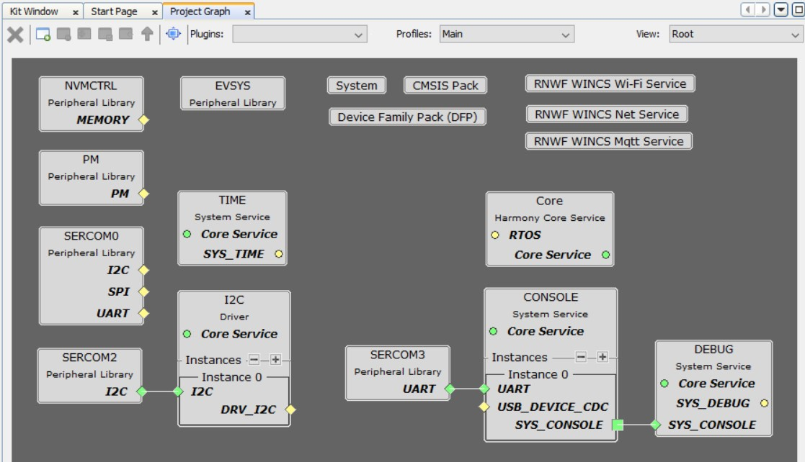	

## Hardware Used:

- [PIC32CM LS00 Curiosity Nano + Touch Evaluation Kit](https://www.microchip.com/DevelopmentTools/ProductDetails/PartNO/EV41C56A)
- [Curiosity Nano Explorer](https://www.microchip.com/en-us/development-tool/EV58G97A)
- [RNWF02 Add-on Board](https://www.microchip.com/en-us/development-tool/ev72e72a)
- [mikroBUS Shuttle Bundle](https://www.mikroe.com/mikrobus-shuttle-bundle)
- [Mikroe Environment 3 Click](https://www.mikroe.com/environment-3-click#/298-input_voltage-3_3v)
- [Mikroe Grid-Eye Click](https://www.mikroe.com/grid-eye-click)
- [Mikroe PIR Click](https://www.mikroe.com/pir-click)

## Software/Tools Used:
 This project has been verified to work with the following versions of software tools:  

Refer [Project Manifest](./firmware/src/config/default/harmony-manifest-success.yml) present in harmony-manifest-success.yml under the project folder *firmware/src/config/default*  
- Refer the [Release Notes](../../../../../release_notes.md#development-tools) to know the **MPLAB® X IDE** and **MCC** Plugin version. Alternatively, [Click Here](https://github.com/Microchip-MPLAB-Harmony/reference_apps/blob/master/release_notes.md#development-tools).

 Because Microchip regularly update tools, occasionally issue(s) could be discovered while using the newer versions of the tools. If the project doesn’t seem to work and version incompatibility is suspected, It is recommended to double-check and use the same versions that the project was tested with.  

To download original version of MPLAB® Harmony v3 packages, refer to document
[How to Use the MPLAB® Harmony v3 Project Manifest Feature](https://ww1.microchip.com/downloads/en/DeviceDoc/How-to-Use-the-MPLAB-Harmony-v3-Project-Manifest-Feature-DS90003305.pdf)

## Hardware Setup:
- Mount the Mikroe Shuttle Base Board on the mikroeBUS in the Curiosity Nano Explorer Board 
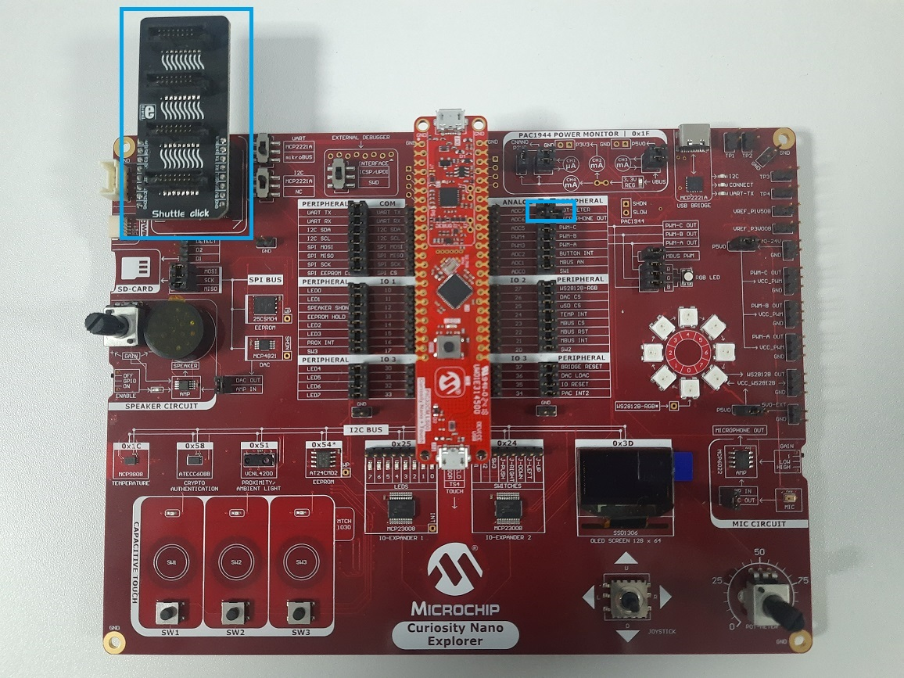

  **Note:** Remove the shorted jumper on the Microphone OUT pin for I2C communication as shown in the above figure.

- Connect all the Mikroe Click boards and RNWF Add on Boards on the Mikroe Shuttle Extensions
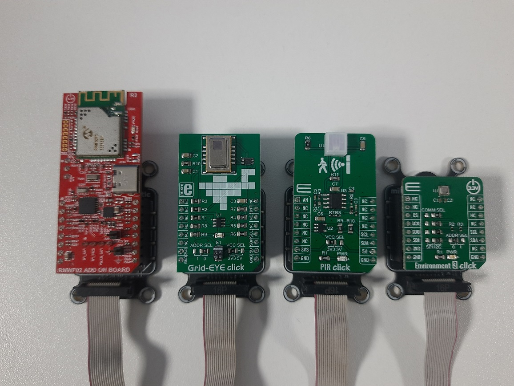

- Attach all the Mikroe Shuttle Extensions with the Mikroe Shuttle Base Board using 16-pin flat cables 
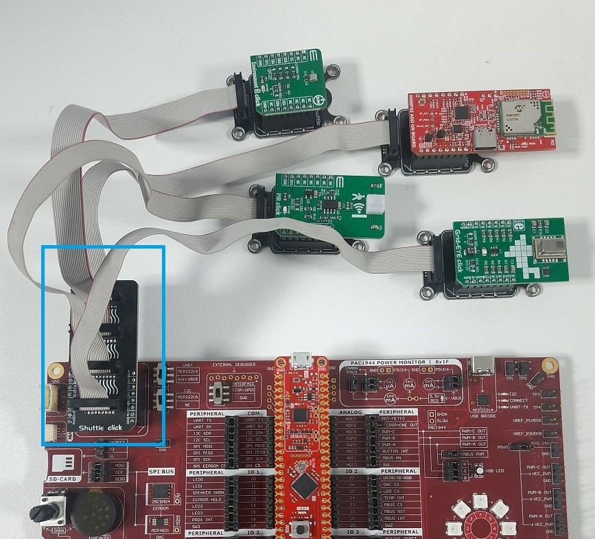

- Connect the PIC32CM LS00 Curiosity Nano + Touch Evaluation Kit to the Host PC as a USB Device through a Type-A male to micro-B USB cable connected to Micro-B USB (Debug USB) port  
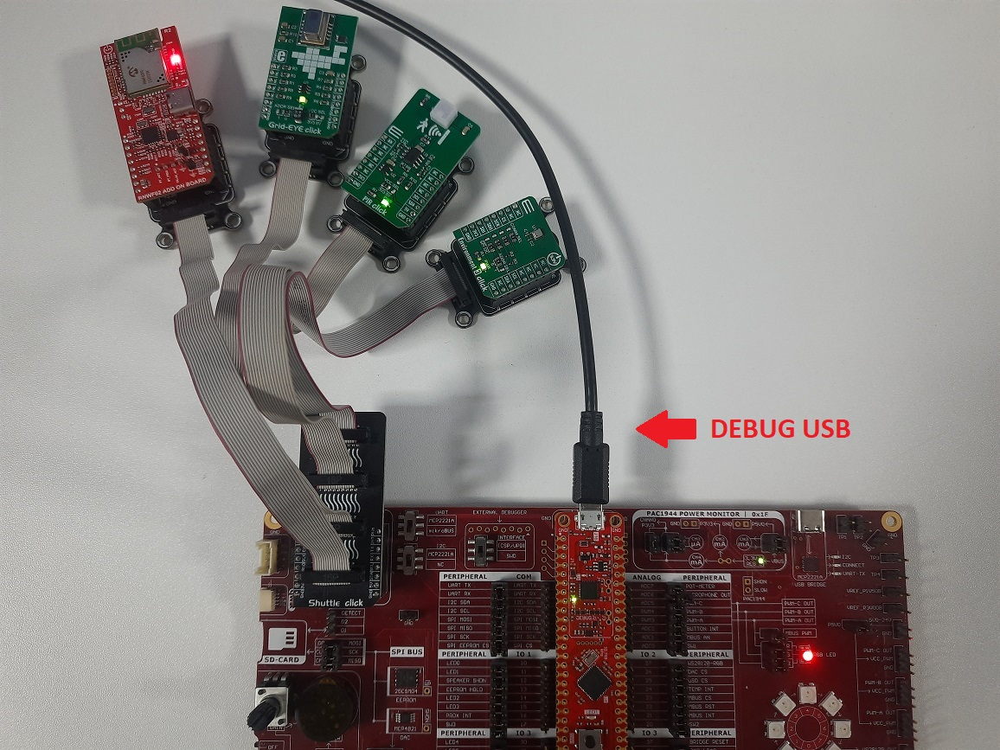

## Programming hex file:
The pre-built hex file can be programmed by following the below steps.  

### Steps to program the hex file
- Open MPLAB® X IDE
- Close all existing projects in IDE, if any project is opened.
- Go to File -> Import -> Hex/ELF File
- In the "Import Image File" window, Step 1 - Create Prebuilt Project, Click the "Browse" button to select the prebuilt hex file
- Select Device has "PIC32CM5164LS00048"
- Ensure the proper tool is selected under "Hardware Tool"
- Click on Next button
- In the "Import Image File" window, Step 2 - Select Project Name and Folder, select appropriate project name and folder
- Click on Finish button
- In MPLAB® X IDE, click on "Make and Program Device" Button. The device gets programmed in sometime

## Programming/Debugging Application Project:
- Open the project group (pic32cm_ls00_cnano_aws_iot/firmware/aws_iot_pic32cm_ls00_cnanogroup) in MPLAB® X IDE
- Ensure "PIC32CM LS00 Curiosity Nano" is selected as hardware tool to program/debug the application
- Build the code and program the device by clicking on the "make and program" button in MPLAB® X IDE tool bar
- Debugging the project can be done by clicking on the “Debug Main Project” button in MPLAB® X IDE tool bar
- Follow the steps in "Running the Demo" section below.

## Running the Demo:
- Open a standard terminal application on the computer (like Putty or Tera Term) and configure the virtual COM port
- Set the serial baud rate to 115200 baud in the terminal application.

- Wait for the initialization prints in the serial port terminal
  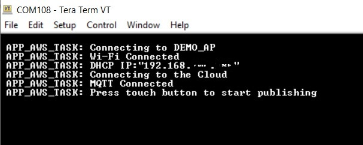 

- Press the touch button on the PIC32CM LS00 Curiosity Nano + Touch Evaluation Kit to start the message pubishing in the AWS IoT Cloud
  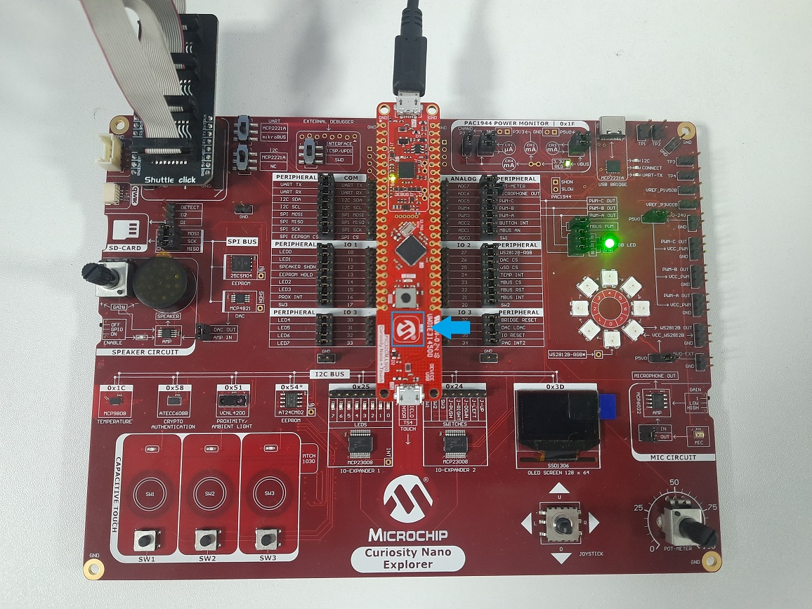

- After the button press, the serial console shows the published sensor data 
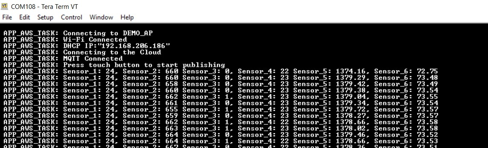 

- Open the AWS IoT Cloud in the browser and select the MQTT test client
  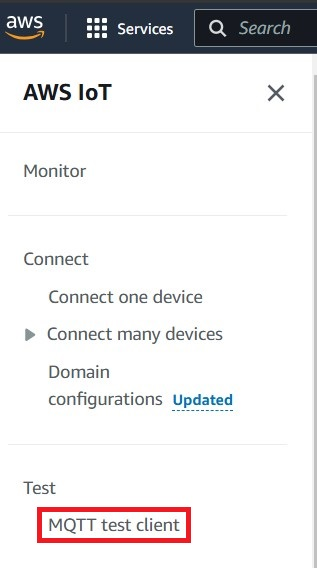    
  
- Enter the publish topic **/aws_iot_pic32c/** in the topic Subscribe section and click **Subscribe** button
  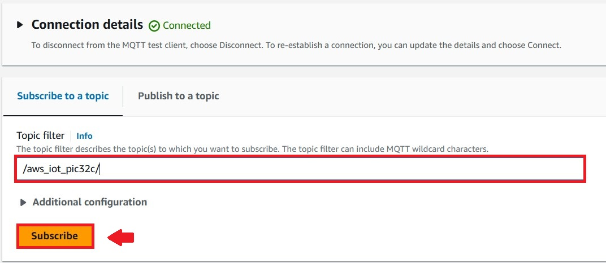 

- All sensor data are updated with the time stamps in the AWS Cloud and also serial console
  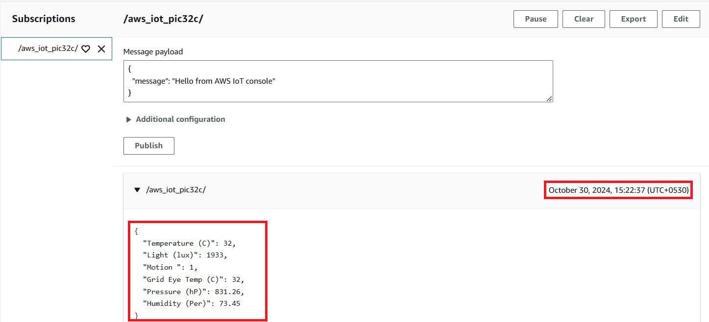 
  

  ## Note:
  RGB LED indicates MQTT connected or not:

 	- The RED LED is turned ON when the board is not connected to MQTT
	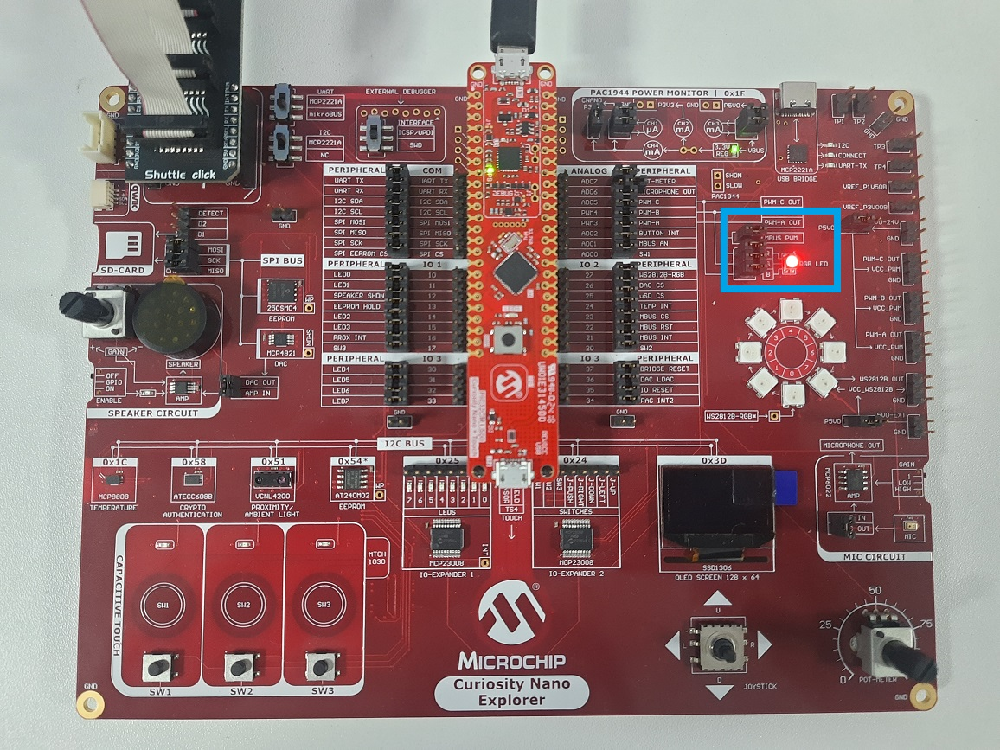  

	- The GREEN LED is turned ON when the board is connected to MQTT 
	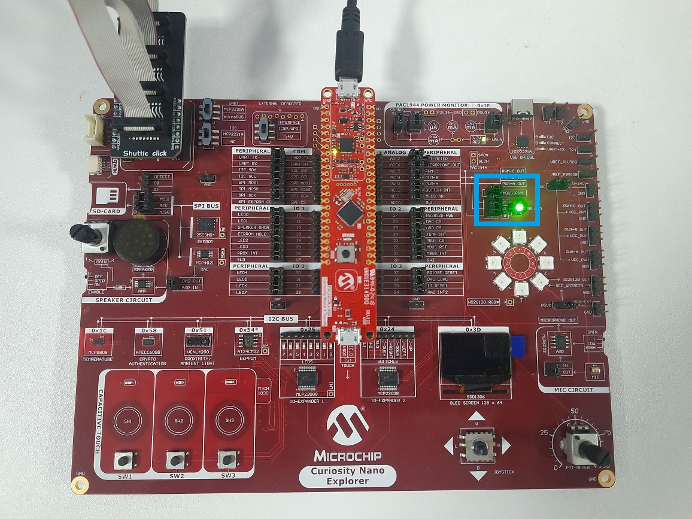  

## AWS Account Setup:

To run the AWS Cloud IoT core solution, an AWS account is required. The following are the steps to configure an AWS account.

Amazon Web Services (AWS) provides computing services for a fee. Some are offered for free on a trial or small-scale basis. By signing up for your AWS account, you are establishing an account to access a wide range of computing services.

Think of your AWS account as your root account for AWS services. It is very powerful and gives you complete access. Be sure to protect your username and password. You control access to your AWS account by creating individual users and groups using the Identity and Access Management (IAM) Console. You also assign policies (permissions) to the group from the IAM Console.

### **Create your own AWS account**

1.  Create AWS account

    - Go to [Amazon AWS](https://aws.amazon.com/) and follow instructions to create your own AWS account

    - Additional details can be found at [Create and activate a new AWS
      account](https://aws.amazon.com/premiumsupport/knowledge-center/create-and-activate-aws-account)

2.  Secure root account with MFA (multi-factor authentication)

    - This is an important step to better secure your root account against attackers. Anyone logging in not only needs to know the
      password, but also a constantly changing code generated by an MFA device.

    - AWS recommends several MFA device options at the link [Multi-Factor Authentication (MFA) for IAM](https://aws.amazon.com/iam/details/mfa/)

    - The quickest solution is a virtual MFA device running on a phone. These apps provide the ability to scan the QR code AWS will generate to set up the MFA device.

      - Return to [Amazon AWS](https://aws.amazon.com/) and click the Sign in to the Console.

      - If it asks for an IAM username and password, select the Sign-in using root account credentials link.

      - Enter the email and password for your AWS account.

      - Under Find Services search for IAM and select it to bring up the Identity and Access Management options.

      - Click on Activate MFA (Multi-factor Authentication) on your root account

3.  Creating an admin IAM user AWS best practices recommend not using your root account for standard administrative tasks, but to create a
    special admin user for those tasks.
    See [lock-away-credentials](https://docs.aws.amazon.com/IAM/latest/UserGuide/best-practices.html#lock-away-credentials)

4.  Follow the instructions at [Create an administrative user](https://docs.aws.amazon.com/IAM/latest/UserGuide/getting-started_create-admin-group.html) for
    creating an admin user.

5.  Enable MFA (multi-factor authentication) for the admin user. See [Require multi-factor authentication (MFA)](https://docs.aws.amazon.com/IAM/latest/UserGuide/best-practices.html#enable-mfa-for-privileged-users)

### **Creating Device Certificate to AWS IoT Cloud Service**

- Login to your AWS account.
- Go to AWS IoT Core services.
- Under **Manage > All devices > Things**, click **Create Things**.
- Select **Create a Single Thing**.
- Enter the thing name of user choice and click **Next** (e.g., pic32c_aws_iot).
- Click on **Auto-generate a new certificate** and select **Create Thing**.
- Create a new policy name of user choice (e.g., pic32c_aws_iot_policy).
- Select **Allow** under **Policy Effect**.
- Under **Policy action** option, select * to select all the actions.
- Under **Policy resources** option, select * to select all the resources and click **Create**.
- Go to the **Create single thing** previous tap in the browser and add the newly added policy.
- Click **Create**
- Download the Private, Public keys, Root and Device Certificates. 
- Activate the device certificate by clicking **Activate Certificate** option
- Select the **pic32c_aws_iot** thing and copy the ARN for IoT Connect, Publish, Subscribe and Receive policies.
- Under **Security > Policies**, select **pic32c_aws_iot_policy**.
- Copy the Policy ARN which is used for the MQTT Broker Configuration in the Harmony v3 Configurator.

### **Uploading Device Certificate to RNWF Add on Board**

- Use the [Certificate And Key Utility](https://onlinedocs.microchip.com/oxy/GUID-D0CB3D06-2ABE-4892-963E-65CAE080D507-en-US-1/GUID-9054B771-5A0F-4359-8E7E-5C4F22B97AC9.html) to upload the **Private Key and Device Certificate** for AWS IOT Cloud Service

	**Note:** Refer to the [Windows Send To Utility](https://onlinedocs.microchip.com/oxy/GUID-D0CB3D06-2ABE-4892-963E-65CAE080D507-en-US-1/GUID-4B300240-D702-44AB-A81C-7E4810C1EDCE.html) for Windows Machine

## Comments:
- Reference Training Module: [Arm TrustZone Getting Started Application on PIC32CM LS60 (Arm Cortex-M23) MCUs](https://developerhelp.microchip.com/xwiki/bin/view/software-tools/harmony/pic32cm-trustzone-getting-started-training-module/)
- This application demo builds and works out of box by following the instructions above in "Running the Demo" section. If you need to enhance/customize this application demo, you need to use the MPLAB® Harmony v3 Software framework. Refer links below to setup and build your applications using MPLAB® Harmony.
	- [How to Setup MPLAB® Harmony v3 Software Development Framework](https://ww1.microchip.com/downloads/aemDocuments/documents/MCU32/ProductDocuments/SupportingCollateral/How-to-Setup-MPLAB-Harmony-v3-Software-Development-Framework-DS90003232.pdf)	
	- [Video - How to Set up the Tools Required to Get Started with MPLAB® Harmony v3 and MCC](https://www.youtube.com/watch?v=0rNFSlsVwVw)	
	- [Create a new MPLAB® Harmony v3 project using MCC](https://developerhelp.microchip.com/xwiki/bin/view/software-tools/harmony/getting-started-training-module-using-mcc/)
	- [Update and Configure an Existing MHC-based MPLAB® Harmony v3 Project to MCC-based Project](https://developerhelp.microchip.com/xwiki/bin/view/software-tools/harmony/update-and-configure-existing-mhc-proj-to-mcc-proj/)
	- [How to Build an Application by Adding a New PLIB, Driver, or Middleware to an Existing MPLAB® Harmony v3 Project](https://ww1.microchip.com/downloads/aemDocuments/documents/MCU32/ProductDocuments/SupportingCollateral/How-to-Build-an-Application-by-Adding-a-New-PLIB-Driver-or-Middleware-to-an-Existing-MPLAB-Harmony-v3-Project-DS90003253.pdf)	

## Revision:
- v1.7.0 - Released demo application