# Secure Firmware Upgrade with PIC32CM LS60 Curiosity Pro Evaluation Kit
<h2 align="center"> <a href="https://github.com/Microchip-MPLAB-Harmony/reference_apps/releases/latest/download/pic32cm_ls60_secure_firmware_upgrade.zip" > Download </a> </h2>

-----
## Description

This application demonstrates the Secure Firmware Upgrade on the PIC32CM LS60 microcontroller (MCU) through UART.

The application contains three projects:
- **host_app_nvm:** 
    Sends the encrpyted firmware through UART to the client.

- **bootloader:**
    Receives the encrypted application firmware, decrypts and verifies the firmware. After verification, the received firmware will be executed.

- **test_app:** 
	Firmware to be transferred and programmed on the client side. 

**Note:** There are 6 projects (secure and non-secure projects) present inside the [firmware](./firmware/) folder. Only secure projects are used for this secure firmware upgrade demo.

## Implementation

The Secure Firmware Upgrade process is initiated on the Host through a series of steps as follows:
- The Target Firmware is encrypted utilizing the Private Key
- Authentication Tag is also encrypted using the same Private Key
- To authenticate the Target Firmware on the client side, a Hash Function is applied to generate a Firmware Digest
- The Firmware Digest is then signed with the Private Key to produce a digital signature for the firmware
- A Public Key is derived to facilitate the verification of the firmware, based on the Private Key

**Note:** Encrypted Firmware is divided into smaller segments as per the client's page size requirements.

For the Client, the Secure Firmware Upgrade is executed through the following procedures:
- The Encrypted Firmware is decrypted with the Private Key, which is verified by the decrypted Authentication Tag
- Decrypted image is programmed into the target flash memory
- A Digest is computed for the received firmware
- The firmware's integrity is authenticated by using the Public Key in conjunction with the Received Signature and the Calculated Digest

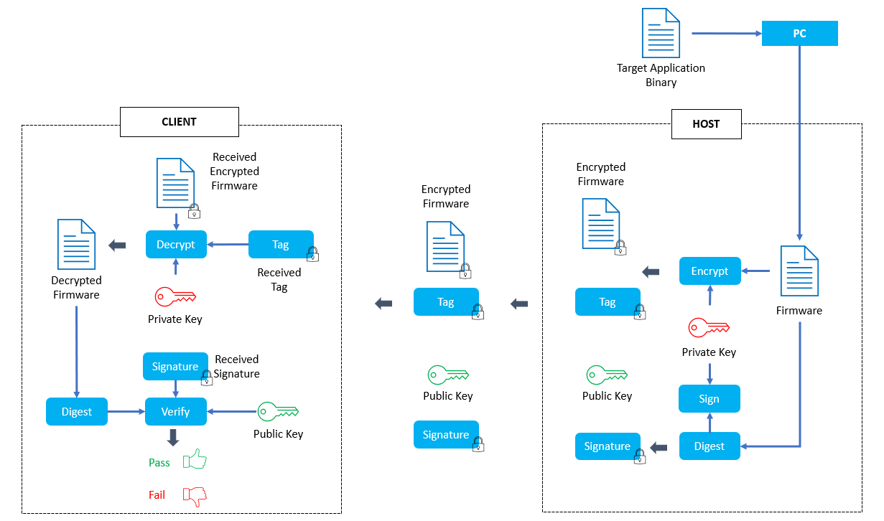

## Modules/Technology Used:

- Peripheral Modules      
    - NVMCTRL
    - EVSYS
    - NVIC
    - PORT
    - Power Manager (PM)
    - SERCOM - UART
	- SERCOM - I2C
- Drivers
    - ATECC608 Driver

- Middleware Libraries
    - Crypto Authentication Libary

	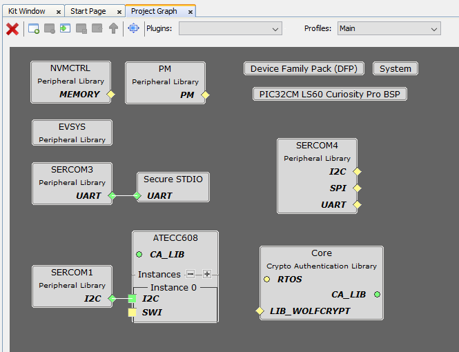 

## Hardware Used:

- [PIC32CM LS60 Curiosity Pro Evaluation Kit](https://www.microchip.com/en-us/development-tool/EV76R77A) - 2 Nos

## Software/Tools Used:
 This project has been verified to work with the following versions of software tools:  

Refer Project Manifest
(
 [Host](./firmware/host_app_nvm_secure/src/config/pic32cm_ls60_cpro/harmony-manifest-success.yml),
 [Client](./firmware/bootloader_secure/src/config/pic32cm_ls60_cpro/harmony-manifest-success.yml)
) present in harmony-manifest-success.yml under the project folder *firmware/src/config/pic32cm_ls60_cpro*  

- Refer the [Release Notes](../../../release_notes.md#development-tools) to know the **MPLAB® X IDE** and **MCC** Plugin version. Alternatively, [Click Here](https://github.com/Microchip-MPLAB-Harmony/reference_apps/blob/master/release_notes.md#development-tools)
- Any Serial Terminal application like Tera Term terminal application.

 Because Microchip regularly update tools, occasionally issue(s) could be discovered while using the newer versions of the tools. If the project doesn’t seem to work and version incompatibility is suspected, It is recommended to double-check and use the same versions that the project was tested with.  

To download original version of MPLAB® Harmony v3 packages, refer to document [How to Use the MPLAB® Harmony v3 Project Manifest Feature](https://ww1.microchip.com/downloads/en/DeviceDoc/How-to-Use-the-MPLAB-Harmony-v3-Project-Manifest-Feature-DS90003305.pdf)

## Hardware Setup:
-   **PIC32CM LS60 Curiosity Pro Evaluation Kits** are used as **Host** and **Client**

    

	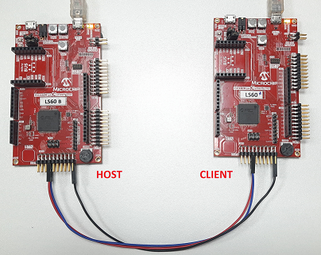  
    

-   Connect the UART lines (TX and RX) and Ground (GND) between the **PIC32CM LS60 Curiosity Pro Evaluation Kits**  as per the pin connections shown below

    |Host Extention 3 (EXT3)|Client Extention 3 (EXT3)|
    |----------|----------|
    |TX, PIN 14|RX, PIN 13|
    |RX, PIN 13|TX, PIN 14|
    |GND, PIN 2|GND, PIN 2|

-   Connect a micro-USB cable to the DEBUG USB port on both PIC32CM LS60 Curiosity Pro Evaluation Kit to power the board and for programming and debugging.

## Programming hex file:

The pre-built hex file can be programmed by following the below steps

### Steps to program the hex file

- Open MPLAB® X IDE
- Close all existing projects in IDE, if any project is opened.
- Go to File -> Import -> Hex/ELF File
- In the "Import Image File" window, Step 1 - Create Prebuilt Project, click the "Browse" button to select the prebuilt hex file.
- Select Device has "PIC32CM5164LS60100"
- Ensure the proper tool is selected under "Hardware Tool"
- Click on "Next" button
- In the "Import Image File" window, Step 2 - Select Project Name and Folder, select appropriate project name and folder
- Click on "Finish" button
- In MPLAB® X IDE, click on "Make and Program Device" Button. The device gets programmed in sometime.
- Follow the steps in "Running the Demo" section below

## Programming/Debugging Application Project:

- **Host**:
    - Open the host project (firmware/host_app_nvm_secure/host_app_nvm_secure.X) in MPLAB® X IDE.
    - Ensure "PIC32CM LS60 Curiosity Pro Evaluation Kit" is selected as hardware tool to program/debug the application.
    - Build the code and program the device by clicking on the "Make and Program Device" button in MPLAB® X IDE tool bar.

- **Client**:
    - Open the client project (firmware/bootloader_secure/bootloader_secure.X) in MPLAB® X IDE.
    - Ensure "PIC32CM LS60 Curiosity Pro Evaluation Kit" is selected as hardware tool to program/debug the application.
    - Build the code and program the device by clicking on the "Make and Program Device" button in MPLAB® X IDE tool bar.

- Debugging the project can be done by clicking on the “Debug Main Project” button in MPLAB® X IDE tool bar
- Follow the steps in "Running the Demo" section below.

## Running the Demo:

**Note:** Follow the instructions in the Key Provisioning with 32-bit MCU Secure Devices using the TPDS application note (click here) to program the Secret Key and the I/O Protection Key for both the Host and Client boards. These keys are essential for running the secure firmware upgrade demo on both boards.

- **Host**:
    - Open a standard terminal application on the computer (like Putty or Tera Term) and configure the virtual COM port.
    - Set the serial baud rate to 115200 baud in the terminal application.
    - Wait for the initialization prints in the serial port terminal. If it does not show any prints, press the “RESET” button on the Evaluation Board which resets the development board.

    

	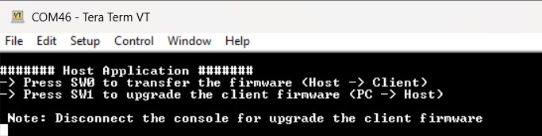  
    

- **Client**:
    - Open a standard terminal application on the computer (like Putty or Tera Term) and configure the virtual COM port.
    - Set the serial baud rate to 115200 baud in the terminal application.
    - Wait for the initialization prints in the serial port terminal. If it does not show any prints, press the “RESET” button on the Evaluation Board which resets the development board.

    

	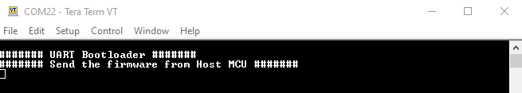  
    

- Disconnect or close the serial console for the Host MCU to give the access for Host PC to transfer the client firmware.

- Press the SW1 button on the Host Evaluation Board to receive the Client firmware from the PC.

    

	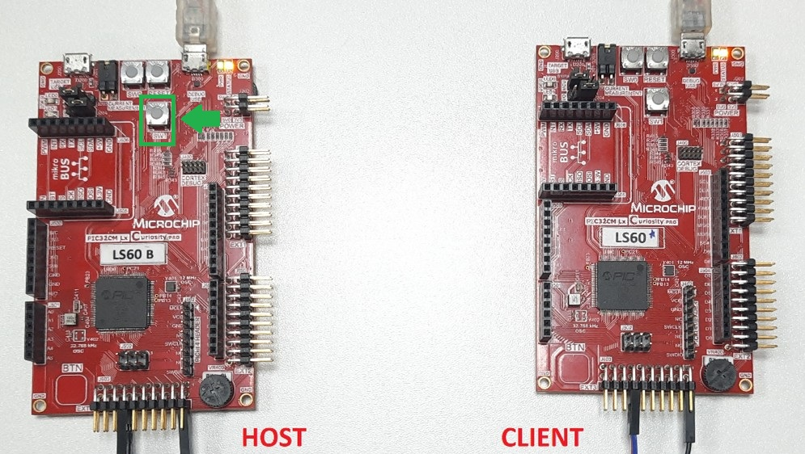  
    

    **Note:** LED1 on the Host Evaluation Board will illuminate to indicate that the Host MCU is prepared for the client firmware reception.

    

	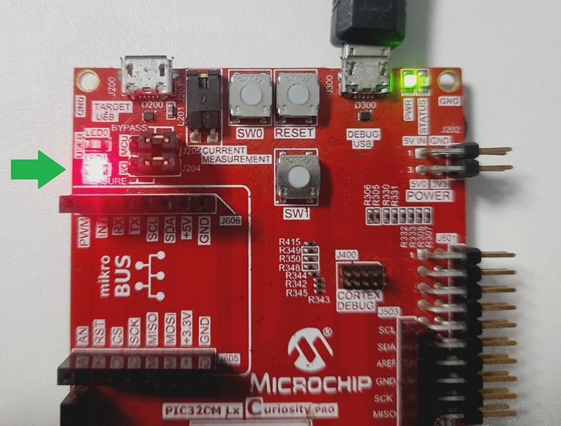  
    

- Open the command prompt and run the python script (**btl_host.py**) as used to transfer the target application binary file with the configuration bits to the Host MCU board.

    **Command:** python <harmony3_path>/bootloader/tools/btl_host.py -v -i <COM PORT> -d PIC32CM -a 0x9000 -f <downloaded path>/pic32cm_ls60_secure_firmware_upgrade/hex/test_app/test_app_secure.X.production.bin -c <downloaded path>/pic32cm_ls60_secure_firmware_upgrade/scripts/application_user_configurations_out

    

	  
    

- Reopen the serial console for the Host Evaluation Board.

- Press the SW0 button on the Host Evaluation Board to upgrade the Client firmware. The progress of the firmware upgrade will be displayed in the terminal console.
 
    

	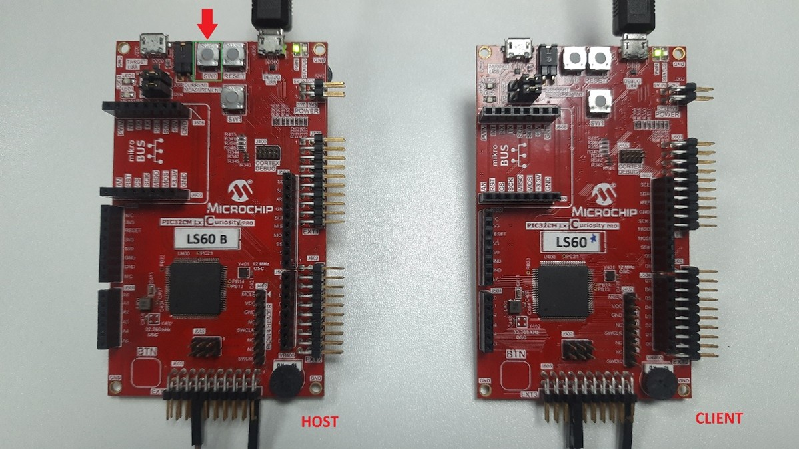  
    

    **Note:** The LED0 on the Host Evaluation Board will illuminate to indicate that the Host MCU has initiated the secure firmware upgrade on the client.

    

	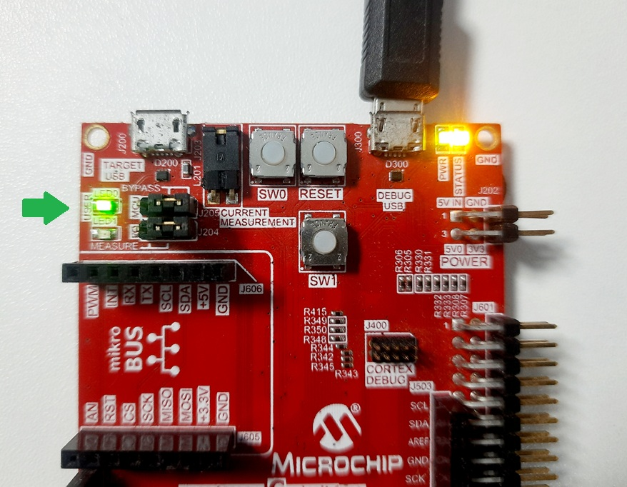  
    

    

	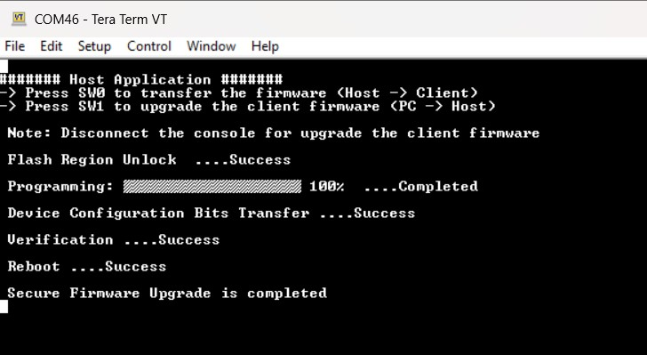  
    

- Once the firmware update is completed, the LED0 on the Host Evaluation Board will be turned off.

    

	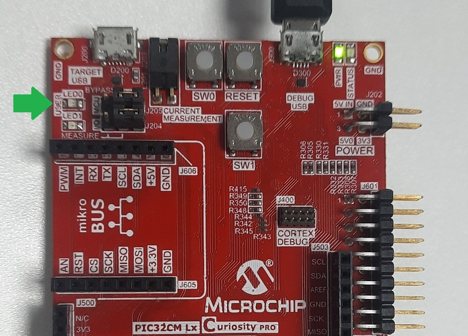  
    

- On the Client Evaluation Board, the LED0 will start blinking and display the startup message on the terminal console.

    

	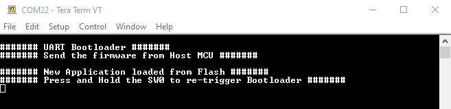  
    

- Press the **SW0** on the Client Evaluation Board to trigger the bootloader from test application.

    

    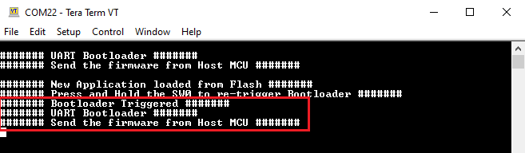 
    

- Press the **RESET** button on the Host Evaluation Board and followed by **SW0** to reprogram the application.

### Loading Test application firmware

Follow these steps to update the target firmware using the MPLAB® Harmony v3.

- Open the Target Application project group (path: pic32cm_ls60_secure_firmware_upgrade/firmware/test_app/test_appgroup) using the MPLAB® X IDE.

- Launch the test_app_secure project by double-clicking the secure project. 

- Modify the test_app_secure and build the project. 

- The updated target application (.bin file) is automatically retrieved from the hex/test_app folder during the client firmware upgrade process

- No need to update the configuration bits of the target firmware. The Host MCU will automatically uses aleady generated the configuration bits (**application_user_configurations_out.txt**) of the target firmware.

**Note:** Any new peripheral is integrated into the target firmware, and the user row configuration (Configuration Bits) for the target/client application is correspondingly updated within the Host MCU.

Follow these steps to update the target firmware configuration bits.

- Open the application_user_configurations_in.txt in a file editor (like Notepad or Visual Studio Code).

- Edit the configuration bits as per the peripheral usage in the test_app_secure project.

    

    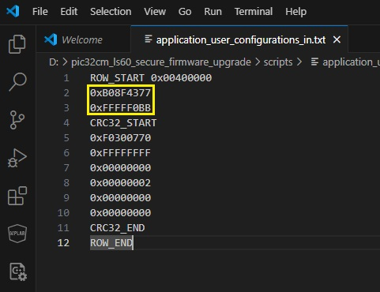 
    

    **Note:**
    - The Host MCU stores the Client’s Configuration Bits values in the secure data memory region (0x0040_0000).
    - For more information, refer to the NVM Configuration Rows section in the Memories chapter on the device datasheet.

- Open the command prompt and run the python script (btl_dev_cfg_gen.py)to create the application_user_configurations_out.txt configuration file will be used by the btl_host.py script to update the configuration bits while programming the target/client application.

    

    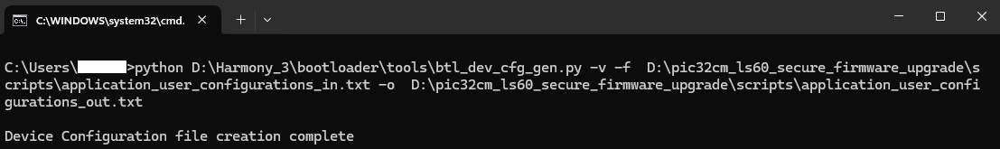 
    

## Comments:
- This application demo builds and works out of box by following the instructions above in "Running the Demo" section. If you need to enhance/customize this application demo, you need to use the MPLAB Harmony v3 Software framework. Refer links below to setup and build your applications using MPLAB Harmony.
- [Getting Started with the PIC32CM LE00/LS60/LS60 Curiosity Pro Board](https://ww1.microchip.com/downloads/aemDocuments/documents/MCU32/ApplicationNotes/ApplicationNotes/AN4511-Getting-Started-with-the-PIC32CM-LE00-LS00-LS60-Curiosity-Pro-Board-DS00004511.pdf)
- [Secure Boot on PIC32CM LS60 Curiosity Pro Evaluation Kit using MPLAB® Harmony v3 Software Framework](https://developerhelp.microchip.com/xwiki/bin/view/software-tools/harmony/secure-boot-app-pic32cm-ls60/)
- [PIC32CM LS00/LS60 Security Reference Guide](https://ww1.microchip.com/downloads/aemDocuments/documents/MCU32/ApplicationNotes/ApplicationNotes/00003992B.pdf)

## Revision:
- v1.7.0 released demo application
